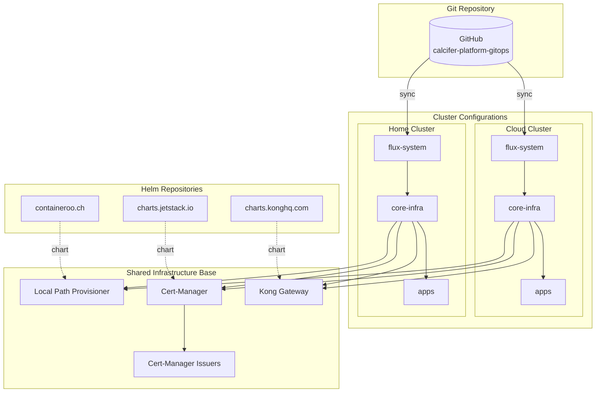
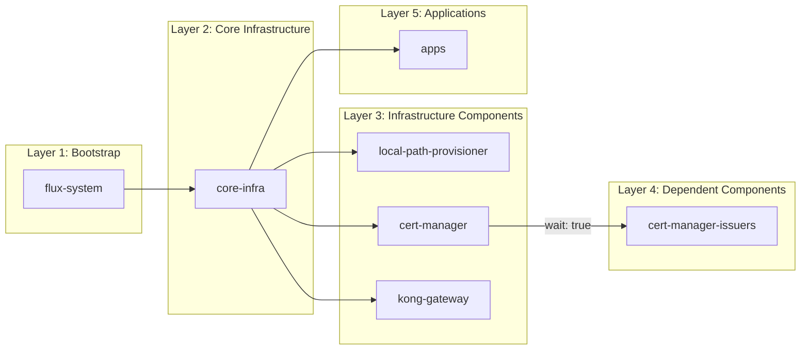

# Calcifer Platform GitOps

Infrastructure as Code repository for the **Calcifer Platform**, managed through FluxCD GitOps principles. This repository defines the complete Kubernetes infrastructure and application deployments for multiple environments.

## Overview

This GitOps repository implements a declarative approach to infrastructure management using:
- **FluxCD v2.7.5** for continuous delivery and reconciliation
- **Kustomize** for configuration management and overlays
- **Helm** for packaged application deployments

The platform supports **multi-cluster deployments** with shared base configurations and cluster-specific overlays.

## Clusters

| Cluster | Purpose | Description |
|---------|---------|-------------|
| **cloud** | Production | Cloud VPS cluster for production workloads |
| **home** | Development/Testing | Home lab cluster for testing and development |

## Architecture



## Dependency Flow



## Components

| Component | Version | Namespace | Description |
|-----------|---------|-----------|-------------|
| **FluxCD** | v2.7.5 | flux-system | GitOps toolkit (source, kustomize, helm, notification controllers) |
| **Local Path Provisioner** | 0.0.32 | kube-system | Dynamic local storage provisioning for single-node clusters |
| **Kong Gateway** | 2.x | kong | API Gateway and Ingress Controller (DaemonSet with hostNetwork) |
| **Cert-Manager** | v1.14.x | cert-manager | Automatic TLS certificate management with Let's Encrypt |

## Repository Structure

```
.
├── clusters/
│   ├── cloud/                          # Cloud cluster (production)
│   │   └── flux-system/
│   │       ├── gotk-components.yaml    # FluxCD components (auto-generated)
│   │       ├── gotk-sync.yaml          # GitRepository + root Kustomization
│   │       ├── core-infra.yaml         # Infrastructure Kustomization
│   │       ├── apps.yaml               # Applications Kustomization
│   │       └── kustomization.yaml      # Cluster entry point
│   │
│   └── home/                           # Home cluster (development/testing)
│       └── flux-system/
│           ├── gotk-components.yaml
│           ├── gotk-sync.yaml
│           ├── core-infra.yaml
│           ├── apps.yaml
│           └── kustomization.yaml
│
├── infrastructure/
│   ├── base/                           # Shared infrastructure definitions
│   │   ├── namespaces/                 # Namespace definitions
│   │   ├── sources/                    # HelmRepository definitions
│   │   ├── cert-manager/               # Cert-Manager HelmRelease
│   │   ├── cert-manager-issuers/       # ClusterIssuer (Let's Encrypt)
│   │   ├── kong-gateway/               # Kong HelmRelease
│   │   └── local-path-provisioner/     # Storage HelmRelease
│   │
│   ├── cloud/                          # Cloud cluster overlays
│   │   └── *.yaml                      # Kustomization wrappers
│   │
│   └── home/                           # Home cluster overlays
│       └── *.yaml                      # Kustomization wrappers
│
└── apps/
    ├── base/                           # Shared application definitions
    │
    ├── cloud/                          # Cloud cluster applications
    │
    └── home/                           # Home cluster applications
```

## Bootstrap

### Prerequisites

- Kubernetes cluster (tested on single-node setups)
- `kubectl` configured with cluster access
- `flux` CLI installed ([installation guide](https://fluxcd.io/docs/installation/))
- GitHub personal access token with repo permissions

### Bootstrap Cloud Cluster

```bash
export GITHUB_TOKEN=<your-token>
export GITHUB_USER=<your-username>

flux bootstrap github \
  --owner=$GITHUB_USER \
  --repository=calcifer-platform-gitops \
  --branch=master \
  --path=./clusters/cloud \
  --personal
```

### Bootstrap Home Cluster

```bash
export GITHUB_TOKEN=<your-token>
export GITHUB_USER=<your-username>

flux bootstrap github \
  --owner=$GITHUB_USER \
  --repository=calcifer-platform-gitops \
  --branch=master \
  --path=./clusters/home \
  --personal
```

### Verify Installation

```bash
flux get kustomizations
flux get helmreleases -A
```

## Reconciliation Flow

1. **flux-system** Kustomization syncs the cluster configuration
2. **core-infra** Kustomization deploys all infrastructure components
3. Components with `wait: true` block until ready (cert-manager)
4. Dependent components deploy after their dependencies (issuers after cert-manager)
5. **apps** Kustomization deploys applications after infrastructure is ready

## Key Design Decisions

- **Multi-cluster architecture**: Shared base configurations with cluster-specific overlays
- **Kong with hostNetwork**: Enables direct binding to ports 80/443 on bare-metal without LoadBalancer
- **Local Path Provisioner**: Provides dynamic PV provisioning for single-node clusters
- **Let's Encrypt Production**: Automatic TLS certificates via ACME HTTP-01 challenge

## Adding Cluster-Specific Customizations

To add cluster-specific configurations:

1. **Infrastructure overlays**: Add custom Kustomization files in `infrastructure/<cluster>/`
2. **Application overlays**: Add application definitions in `apps/<cluster>/`
3. **Base definitions**: Shared resources go in `infrastructure/base/` or `apps/base/`

Example: Adding a cloud-specific application:
```yaml
# apps/cloud/kustomization.yaml
apiVersion: kustomize.config.k8s.io/v1beta1
kind: Kustomization
resources:
  - ../base/my-app
  - ./my-app-cloud-config.yaml
```

## License

This project is private infrastructure configuration for the Calcifer Platform.

